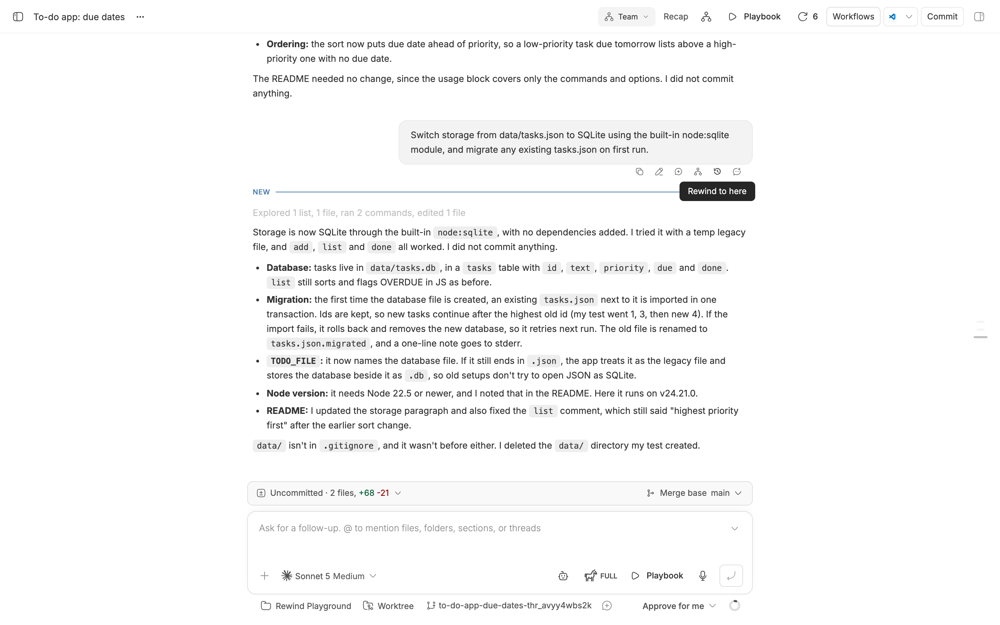
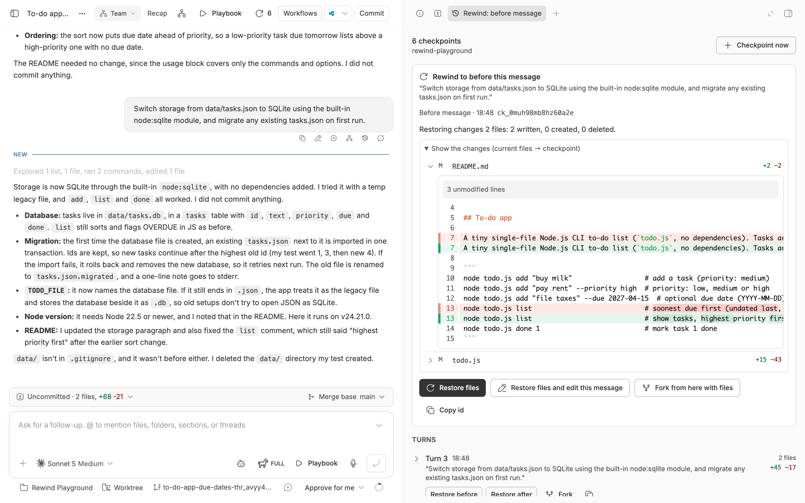
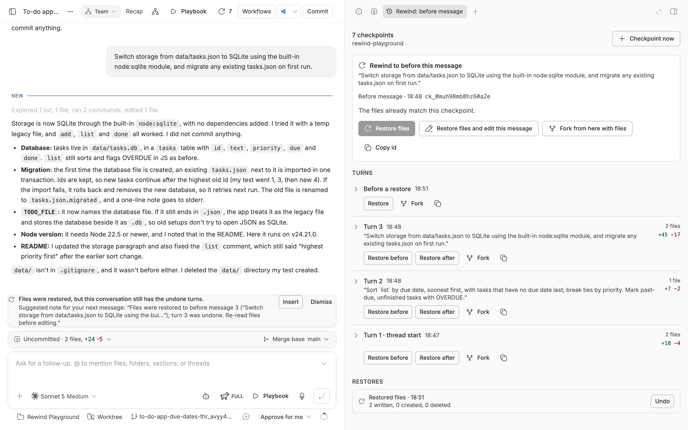
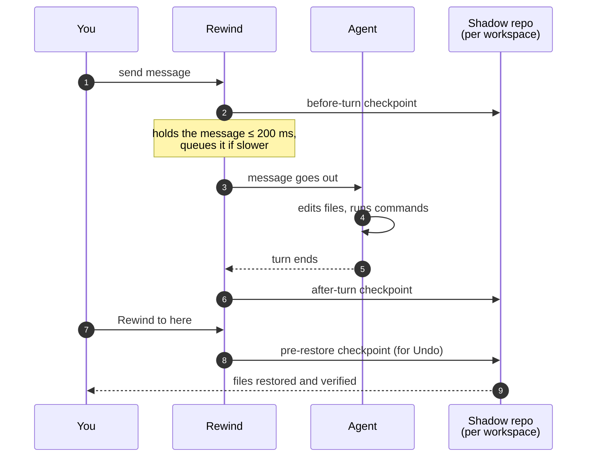

<div align="center">


# Rewind

### Undo an agent's file changes, turn by turn.

Automatic checkpoints for every bb thread, on every provider.<br>
See what each turn changed. Put the files back. Let the conversation go back with them.


[Features](#features) · [Install](#install) · [How it works](#how-it-works) · [Safety](#safe-by-default) · [CLI](#cli) · [Settings](#settings) · [Design doc](docs/DESIGN.md)

<br>



</div>

<br>

## The problem

Your agent ran five turns. The third one went wrong.

bb can fork or edit the **conversation**, but the **files** on disk stay
exactly as turn five left them. You're left to untangle them by hand, or to
hope the agent undoes its own mess.

**Rewind snapshots the workspace at every turn boundary**, before each of
your messages and after each reply, with no setup. Going back becomes
one click, and it can be undone.

|  | Without Rewind | With Rewind |
| --- | :---: | :---: |
| See what a single turn changed | ❌ | ✅ per-file diffs |
| Restore files to before any message | ❌ | ✅ with a preview |
| Rewind files **and** conversation together | ❌ | ✅ |
| Undo a restore | ❌ | ✅ always |
| Fork a thread with the files as they were | ❌ | ✅ |
| Know which side effects can't be undone | ❌ | ✅ flagged |
| Works with any agent provider | — | ✅ |
| Touches your repository's `.git` | — | ❌ never |

## Features

<table>
<tr>
<td width="50%" valign="top">

### ⏪ Rewind to here
On any message: restore the files to **before your message**, or to the
**end of a reply's turn**. You see exactly what will change first.

</td>
<td width="50%" valign="top">

### ✏️ Restore and edit the message
Put the files back **and** replace your message. bb discards it and every
later turn, so files and conversation rewind together.

</td>
</tr>
<tr>
<td valign="top">

### 🔍 Per-turn diffs
The Checkpoints panel lists every turn with its message, the files it
changed, and a diff for each file.

</td>
<td valign="top">

### ↩️ Undo anything
Every restore takes a checkpoint first. The restore can be undone, and so
can the undo.

</td>
</tr>
<tr>
<td valign="top">

### 🌿 Fork with files
Branch the conversation at any message into a **new worktree** whose files
are exactly as they were then, and try another approach.

</td>
<td valign="top">

### ⚠️ Honest about side effects
Turns that ran `git push`, published a package, migrated, deployed, or
wrote outside the workspace are flagged. A restore can't undo those, and
Rewind says so.

</td>
</tr>
</table>

<div align="center">
<table>
<tr>
<td align="center"><br><sub><b>Preview before you restore</b></sub></td>
<td align="center"><br><sub><b>Restored, with Undo one click away</b></sub></td>
</tr>
</table>
</div>

## Install

```sh
bb plugin install git:https://github.com/MacHatter1/bb-plugin-rewind --yes
```

That's it. Checkpointing starts on every thread right away, with nothing to configure.

<details>
<summary><b>Install from a local clone</b></summary>

```sh
git clone https://github.com/MacHatter1/bb-plugin-rewind
cd bb-plugin-rewind
npm install && bb plugin build
bb plugin install path:$PWD --yes
```

</details>

**Requirements**

- bb **0.43+** (Plugin SDK 0.5.9+)
- `git` on the machine that holds the thread's workspace. The workspace
  itself **doesn't** need to be a git repository.
- Forking with files needs a git repository and a provider that can fork
  mid-conversation.

## Where to find it

| Where | What |
| --- | --- |
| **Rewind to here** on a message's action bar | Opens the checkpoint with a preview: **Restore files**, **Restore files and edit this message**, **Fork from here with files**, **Copy id**. |
| **Checkpoints** in the thread's right panel | Every turn with its time, message, and files changed; diffs; restore history with **Undo**; warnings for late checkpoints and skipped files. |
| **⟲ count** in the thread header | Opens the panel. |
| **A note above the message box** | After a files-only restore, a suggested note for your next message, with **Insert** and **Dismiss**. Rewind never sends it. |
| **Palette** (⌘⇧P) | *Rewind: open checkpoints* · *Rewind: checkpoint now* |

## How it works



- **Shadow repository.** Snapshots live in a separate git repository per
  workspace, in the plugin's data directory on the machine that holds the
  workspace. Your repository's `.git` is never written to.
- **Cheap.** Only changed files are re-read. A daily cleanup keeps the
  newest checkpoints per thread.
- **Never slows you down.** A message is held for at most `gateHoldMs`
  (200 ms by default) while its checkpoint is taken. If it takes longer,
  the message is queued with a *"Rewind: saving a checkpoint…"* card and
  sent as soon as the checkpoint is saved (30 s at most, and **Send now**
  works too). If checkpointing fails, the message still goes out and the
  panel shows the gap.
- **Runs where the files are.** The git engine runs as a bb host process on
  the thread's own machine, local or remote.

The full story, including message mapping, restore planning, forks,
retention, cross-platform behaviour, and measured latency, is in
**[docs/DESIGN.md](docs/DESIGN.md)**.

## Safe by default

A restore:

- 🛟 **takes a pre-restore checkpoint first**, and stops if it can't;
- 🙈 **never touches** ignored files (`node_modules`, an ignored `.env`),
  `.git`, nested repositories, files over the size cap, or bb's own chat
  copies (`.bb/chats/`). It lists what it left alone;
- 🗑️ **deletes only** non-ignored files the checkpoint doesn't contain,
  then **verifies** the workspace matches;
- 🧯 **reports a partial restore** (say, a file it had no permission to
  replace), and **Undo** puts every file back;
- ⏸️ **refuses while any thread in that workspace is running**, and offers to
  stop them. Messages to that workspace wait in the queue until it's done;
- 📁 **restores files only.** If the agent committed, the preview warns, and
  commits and branches stay. Commands that reached outside the workspace
  (`git push`, publishes, migrations, deploys, `docker`/`kubectl`, global
  installs, mutating HTTP requests) are listed, because those stay done.

Agents can create checkpoints but **can't restore**. There's deliberately no
restore tool, so the decision stays with you.

## CLI

`bb rewind <command>`: thread commands default to the calling thread, and
`--thread <id>` works anywhere. Every command takes `--json` and `--help`,
and checkpoint ids accept a unique prefix.

```sh
bb rewind list                              # checkpoints by turn, newest first
bb rewind diff <checkpoint> --stat          # what that turn changed
bb rewind restore <checkpoint> --dry-run    # preview
bb rewind restore <checkpoint> --yes        # restore the files
bb rewind undo --yes                        # changed your mind
```

<details>
<summary><b>All commands</b></summary>

| Command | Does |
| --- | --- |
| `list [--limit N]` | Checkpoints by turn, newest first, and restores. |
| `show <checkpoint>` | What a checkpoint captured, changed, and skipped. |
| `diff <checkpoint> [--stat] [--to current\|<id>] [--from <id>] [--path p]` | What that turn changed, or what changed since. |
| `restore <checkpoint> --dry-run` | Preview a restore. |
| `restore <checkpoint> --yes [--stop-running]` | Restore the files, and print a note for your next message. |
| `restore <before-checkpoint> --yes --edit-message "…"` (or `--edit-message-file f`) | Restore the files, then replace the message that checkpoint preceded. |
| `undo [--dry-run \| --yes] [<restore-id>]` | Undo the latest (or given) restore. |
| `checkpoint [--label "…"]` | Take a checkpoint now. |
| `fork <checkpoint> [--prompt "…" \| --prompt-file f] [--title "…"] [--no-wait]` | Fork with files. |
| `status` | Settings, message-gate latency, and the thread's state. |
| `prune [--dry-run]` | Apply retention now; `--thread <id> --yes` deletes one thread's checkpoints. |

</details>

**Agent tools:** `rewind_checkpoint({ label })` and `rewind_list({ limit })`.
The bundled [skill](skills/rewind/SKILL.md) teaches agents to checkpoint
before risky operations and to hand restores to you.

## Settings

`bb plugin config rewind`, or **Settings → Installed plugins → Rewind**.

<details>
<summary><b>All settings</b></summary>

| Setting | Default | |
| --- | --- | --- |
| `enabled` | `true` | Automatic checkpoints. Manual checkpoints, restores, and forks work either way. |
| `gateHoldMs` | `200` | Longest a message is held for its checkpoint before it is queued instead (0–2000). |
| `maxFileSizeMB` | `10` | Larger files are skipped and never touched. |
| `maxCheckpointsPerThread` | `200` | Kept by the daily cleanup. |
| `retentionDays` | `14` | Archived threads' checkpoints are dropped after this. |
| `excludedProjects` | empty | Project ids or names, comma or line separated. |

Workspaces with more than 100,000 files, or 2 GiB of new or changed files
in one snapshot, are marked unsupported instead of snapshotted.

</details>

<details>
<summary><b>Turning it off</b></summary>

```sh
bb plugin disable rewind                    # stop checkpointing everywhere; keeps its data
bb plugin enable rewind
bb plugin config rewind set enabled false   # keep the UI, stop automatic checkpoints
```

`bb plugin remove rewind` removes the plugin and its settings. Shadow
repositories live under `<bb data dir>/plugins/rewind/host-data/shadows/`
on each machine.

</details>

## Development

```sh
npm install
npm run check                    # tsc --noEmit && vitest run
bb plugin build                  # dist/server.js, dist/host.js, dist/app.js
bb plugin install path:$PWD --yes
bb plugin logs rewind -f
```

```
server.ts   wires src/service.ts to bb: hooks, RPC, CLI, agent tools, retention
host.ts     the git engine (src/host/), run on the thread's machine
app.tsx     the UI (src/ui/): Rewind to here, Checkpoints panel, header, palette
skills/     the bundled agent skill
docs/       DESIGN.md and screenshots
```

**Tests** cover the pure modules with unit tests, the host with integration
tests against real git in temp directories, the server through the SDK's
fake plugin host with the real host handlers, and the UI with render
tests. They pass on macOS and Linux; Windows support has been reviewed but
not yet run.

`PLUGIN_OVERVIEW.md` is the store listing; keep it in step with
`bb.description` in `package.json`.

## License

[MIT](LICENSE)
